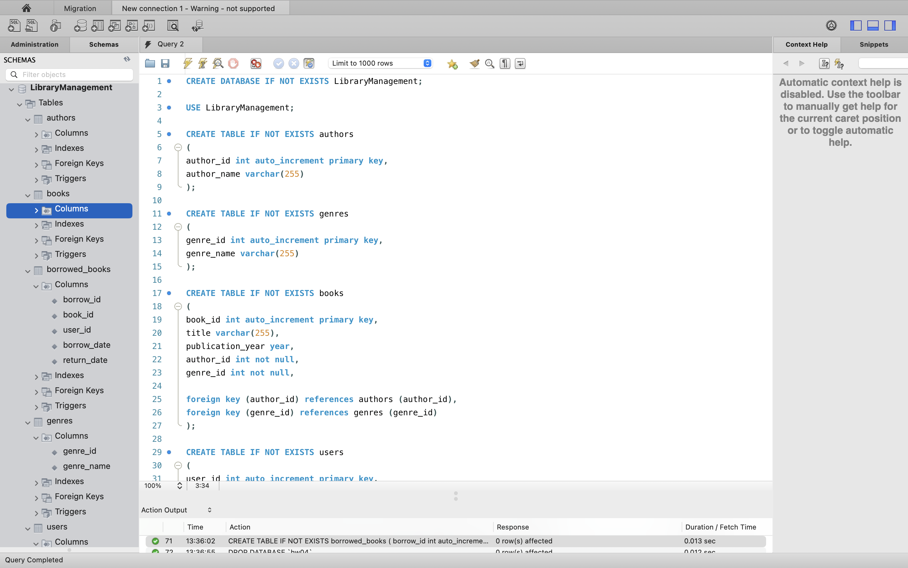
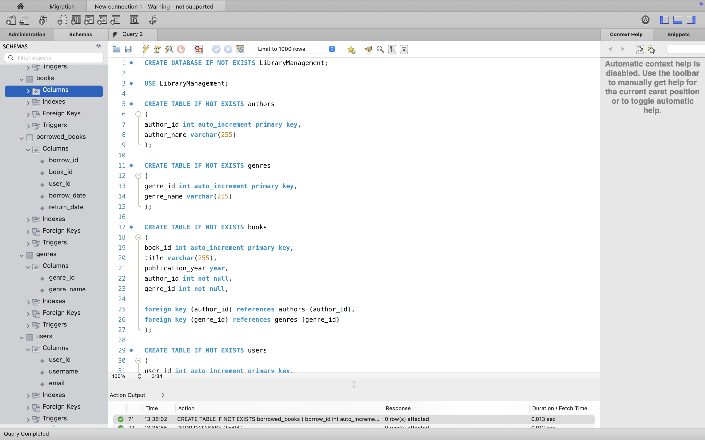
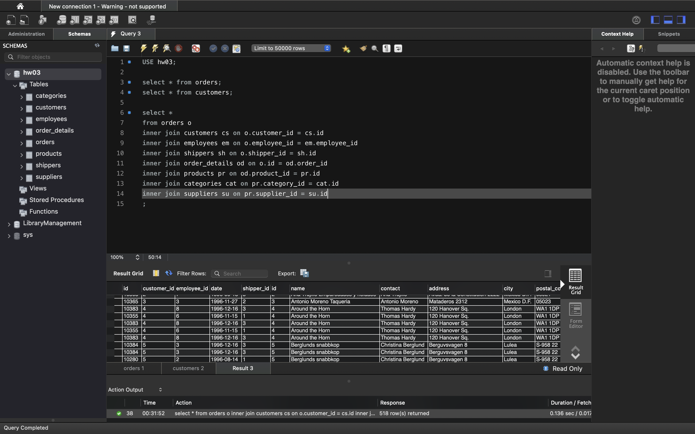
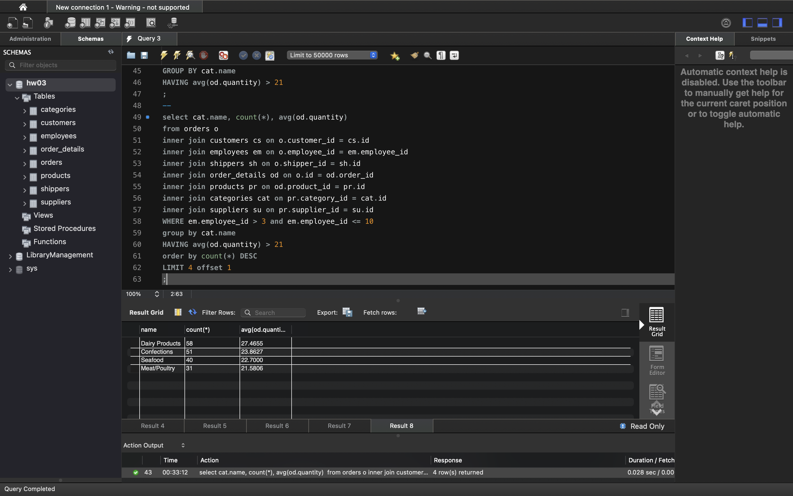

# SQL Commands Overview

This document explains a series of SQL commands used for querying and analyzing data from a database.

## 1. Створіть базу даних для керування бібліотекою книг згідно зі структурою, наведеною нижче. Використовуйте DDL-команди для створення необхідних таблиць та їх зв'язків.
```sql
-- Створення бази даних
CREATE DATABASE IF NOT EXISTS LibraryManagement;

-- Використання створеної бази даних
USE LibraryManagement;

-- Таблиця "authors"
CREATE TABLE IF NOT EXISTS authors (
    author_id INT AUTO_INCREMENT PRIMARY KEY,
    author_name VARCHAR(255) NOT NULL
);

-- Таблиця "genres"
CREATE TABLE IF NOT EXISTS genres (
    genre_id INT AUTO_INCREMENT PRIMARY KEY,
    genre_name VARCHAR(255) NOT NULL
);

-- Таблиця "books"
CREATE TABLE IF NOT EXISTS books (
    book_id INT AUTO_INCREMENT PRIMARY KEY,
    title VARCHAR(255) NOT NULL,
    publication_year YEAR NOT NULL,
    author_id INT NOT NULL,
    genre_id INT NOT NULL,
    FOREIGN KEY (author_id) REFERENCES authors(author_id) ON DELETE CASCADE ON UPDATE CASCADE,
    FOREIGN KEY (genre_id) REFERENCES genres(genre_id) ON DELETE CASCADE ON UPDATE CASCADE
);

-- Таблиця "users"
CREATE TABLE IF NOT EXISTS users (
    user_id INT AUTO_INCREMENT PRIMARY KEY,
    username VARCHAR(255) NOT NULL,
    email VARCHAR(255) NOT NULL
);

-- Таблиця "borrowed_books"
CREATE TABLE IF NOT EXISTS borrowed_books (
    borrow_id INT AUTO_INCREMENT PRIMARY KEY,
    book_id INT NOT NULL,
    user_id INT NOT NULL,
    borrow_date DATE NOT NULL,
    return_date DATE,
    FOREIGN KEY (book_id) REFERENCES books(book_id) ON DELETE CASCADE ON UPDATE CASCADE,
    FOREIGN KEY (user_id) REFERENCES users(user_id) ON DELETE CASCADE ON UPDATE CASCADE
);

``` 



## 2. Заповніть таблиці простими видуманими тестовими даними. Достатньо одного-двох рядків у кожну таблицю.
```sql
-- Заповнення таблиці "authors"
INSERT INTO authors (author_name) 
VALUES 
('Johny Mnemonic'),
('Andrew Backham'),
('Victor Berezhny');

-- Заповнення таблиці "genres"
INSERT INTO genres (genre_name) 
VALUES 
('Science Fiction'),
('Fantasy'),
('Comedy');

-- Заповнення таблиці "books"
INSERT INTO books (title, publication_year, author_id, genre_id) 
VALUES 
('Hologram of Future', 2000, 1, 1),
('Ginger Cookies', 1989, 2, 3),
('Little Rat', 2012, 3, 2);

-- Заповнення таблиці "users"
INSERT INTO users (username, email) 
VALUES 
('Artem', 'artem@example.com'),
('Jane', 'jane@example.com');

-- Заповнення таблиці "borrowed_books"
INSERT INTO borrowed_books (book_id, user_id, borrow_date, return_date) 
VALUES 
(1, 1, '2024-01-01', '2024-01-15'),
(2, 2, '2024-02-01', '2024-02-10');

```


## 3. Перейдіть до бази даних, з якою працювали у темі 3. Напишіть запит за допомогою операторів FROM та INNER JOIN, що об’єднує всі таблиці даних, які ми завантажили з файлів: order_details, orders, customers, products, categories, employees, shippers, suppliers. Для цього ви маєте знайти спільні ключі.

``` sql
USE hw03;

select * from orders;
select * from customers;

select *
from orders o
inner join customers cs on o.customer_id = cs.id
inner join employees em on o.employee_id = em.employee_id
inner join shippers sh on o.shipper_id = sh.id
inner join order_details od on o.id = od.order_id
inner join products pr on od.product_id = pr.id
inner join categories cat on pr.category_id = cat.id
inner join suppliers su on pr.supplier_id = su.id
;
```



## 4. Виконайте запити, перелічені нижче.
* Визначте, скільки рядків ви отримали (за допомогою оператора COUNT). 
* Змініть декілька операторів INNER на LEFT чи RIGHT. Визначте, що відбувається з кількістю рядків. Чому? Напишіть відповідь у текстовому файлі.
* Оберіть тільки ті рядки, де employee_id > 3 та ≤ 10.
* Згрупуйте за іменем категорії, порахуйте кількість рядків у групі, середню кількість товару (кількість товару знаходиться в order_details.quantity)
* Відфільтруйте рядки, де середня кількість товару більша за 21.
* Відсортуйте рядки за спаданням кількості рядків.
* Виведіть на екран (оберіть) чотири рядки з пропущеним першим рядком. 

```sql
select count(*) 
from orders o
INNER JOIN customers cs ON o.customer_id = cs.id
INNER JOIN employees em ON o.employee_id = em.employee_id
INNER JOIN shippers sh ON o.shipper_id = sh.id
INNER JOIN order_details od ON o.id = od.order_id
INNER JOIN products pr ON od.product_id = pr.id
INNER JOIN categories cat ON pr.category_id = cat.id
INNER JOIN suppliers su ON pr.supplier_id = su.id;

--
select count(*)
from orders o
LEFT join customers cs on o.customer_id = cs.id
LEFT join employees em on o.employee_id = em.employee_id
LEFT join shippers sh on o.shipper_id = sh.id
LEFT join order_details od on o.id = od.order_id
RIGHT join products pr on od.product_id = pr.id
LEFT join categories cat on pr.category_id = cat.id
LEFT join suppliers su on pr.supplier_id = su.id
;
--
select count(*) 
from orders o
inner join customers cs on o.customer_id = cs.id
inner join employees em on o.employee_id = em.employee_id
inner join shippers sh on o.shipper_id = sh.id
inner join order_details od on o.id = od.order_id
inner join products pr on od.product_id = pr.id
inner join categories cat on pr.category_id = cat.id
inner join suppliers su on pr.supplier_id = su.id
WHERE em.employee_id > 3 and em.employee_id <= 10
;
--
select cat.name, count(*), avg(od.quantity) 
from orders o
inner join customers cs on o.customer_id = cs.id
inner join employees em on o.employee_id = em.employee_id
inner join shippers sh on o.shipper_id = sh.id
inner join order_details od on o.id = od.order_id
inner join products pr on od.product_id = pr.id
inner join categories cat on pr.category_id = cat.id
inner join suppliers su on pr.supplier_id = su.id
WHERE em.employee_id > 3 and em.employee_id <= 10
GROUP BY cat.name
HAVING avg(od.quantity) > 21
;
--
select cat.name, count(*), avg(od.quantity) 
from orders o
inner join customers cs on o.customer_id = cs.id
inner join employees em on o.employee_id = em.employee_id
inner join shippers sh on o.shipper_id = sh.id
inner join order_details od on o.id = od.order_id
inner join products pr on od.product_id = pr.id
inner join categories cat on pr.category_id = cat.id
inner join suppliers su on pr.supplier_id = su.id
WHERE em.employee_id > 3 and em.employee_id <= 10
group by cat.name
HAVING avg(od.quantity) > 21
order by count(*) DESC
LIMIT 4 offset 1
;
```

